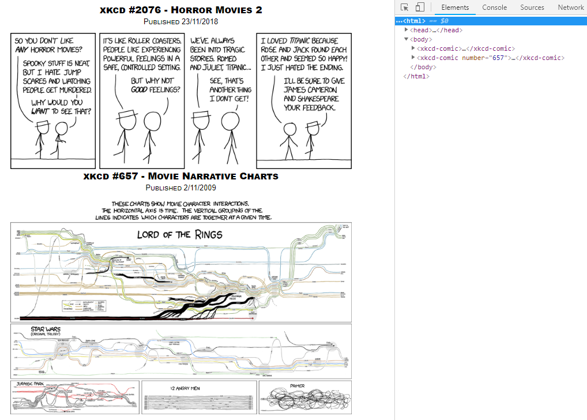

# xkcd-web-component

```html
<html>
    <head>
      <script src="https://unpkg.com/vue"></script>
      <script src="./xkcd-comic.js"></script>
    </head>
    <body>
        <xkcd-comic></xkcd-comic>
        <xkcd-comic number="657"></xkcd-comic>
    </body>
</html>
```




### What is this?

This is a demonstration of a Web Component written using the Vue Javascript framework. It fetches xkcd comics - either the latest or the specified number. This is a standard Vue SFC (single-file component) that is then wrapped up in a Web Component by using Vue CLI. Either the Vue SFC or the Web Component can be used.

### What is a Web Component?

> Web components are a set of web platform APIs that allow you to create new custom, reusable, encapsulated HTML tags to use in web pages and web apps.

Read more about Web Components:

https://developer.mozilla.org/en-US/docs/Web/Web_Components

https://developers.google.com/web/fundamentals/web-components/

https://www.webcomponents.org/introduction

### Why Web Components?

Web Components are *not* an alternative to Javascript frameworks - this one is written with Vue, but it could just as easily be written in plain ES6+. The Web Component standard contains a number of standards - two of which are the Shadow DOM and Custom Elements standards. Web Components encapsulate and contain their own DOM - ensuring compatibility with any other Javascript or CSS on the page.

Web Components also allow for interoperability between Javascript frameworks - especially ones that closely follow the Web Components standard (such as Vue). This means you can write a Vue Web Component and use it inside an Angular component, for example. You probably wouldn't need to use Web Components if your application is written only in one framework.
